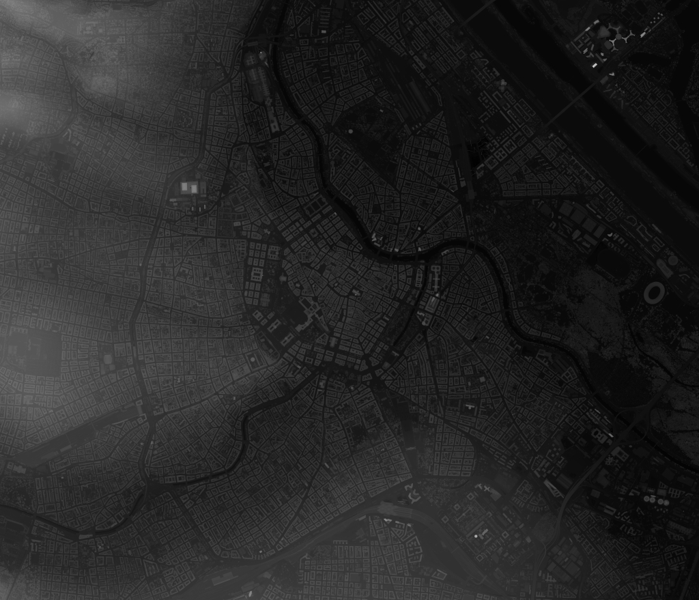

# alpine-terrain-builder

## Overview

This repository contains the following tools:

1. [tile_downloader](src/tile_downloader) for downloading orthophoto tiles, which are used for texturing the generated meshes. 
2. [terrainbuilder](src/terrainbuilder/) for building the highest quality meshes from the downloaded orthophoto tiles and a heightmap dataset.
3. [terrainmerger](src/terrainmerger/) for building a LOD hierarchy from the highest quality meshes by merging them upwards.
4. [terrainconvert](src/terrainconvert/) for converting .tile files into .glb files.

### Core Library
[terrainlib](src/terrainlib/) contains classes common to all the tools above.

### Scripts
The tools typically only handle one tile per command which makes it infeasible to run them manually for a whole region due to the sheer amount of tiles. Therefore, we've created the following python scripts, which automate calling the relevant tools for a specified regions:

1. [batch-builder.py](batch-builder.py) calls [terrainbuilder](src/terrainbuilder/) for all tiles in the specified region.
2. [batch-merger.py](batch-merger.py) calls [terrainmerger](src/terrainmerger/) for all tiles in the specified region.
3. [batch-converter.py](batch-converter.py) calls [terrainconvert](src/terrainconvert/) for all .tile files in the specified directory and its subdirectories.

## Example Workflow

In this example, we'll show how to build the hierarchy for Vienna's city center (Zoom: 13, X: 4468, Y:2840).

### 1. Downloading tiles
The following command will download the basemap tiles from our mirror with the following format: 
https://gataki.cg.tuwien.ac.at/raw/basemap/tiles/{zoom}/{Y}/{X}.jpeg

Example for the root tile: https://gataki.cg.tuwien.ac.at/raw/basemap/tiles/13/2840/4468.jpeg

The tiles will be downloaded into the folder `./tiles/`.

```
./tile-downloader --provider gataki --zoom 13 --row 2840 --col 4468 --max-zoom-level 19
```

### 2. Download heightmap dataset
The meshes are built from a heightmap dataset, therefore we need to download one. For this example we'll only use a small part of the complete dataset for the whole of austria (available at https://gataki.cg.tuwien.ac.at/raw/Oe_2020/, 268 GB to 1.1 TB). The part we're gonna use contains Vienna's city center and it is available at https://gataki.cg.tuwien.ac.at/raw/vienna/innenstadt_gs_1m_mgi.tif (228 MB).



### 3. Building reference meshes
The following command will build reference meshes for the root tile `13/4468/2840` at the target zoom level `19` from the tile textures in `./tiles/` and the dataset `./innenstadt_gs_1m_mgi.tif` and output them in the folder `./meshes`. The SRS used is `EPSG:3857`, as the [demo renderer](https://github.com/polskus/renderer-alpinite) expects coordinates in the WebMercator (EPSG:3857) system.

```
python3 batch-builder.py --terrainbuilder ./terrainbuilder --tile 13 4468 2840 --target-zoom 19 --output-dir ./meshes -- --textures ./tiles/ --dataset ./innenstadt_gs_1m_mgi.tif --mesh-srs EPSG:3857
```

### 4. Building tile hierarchy by merging and simplifying reference meshes
The following command will build the LOD hierarchy from the reference meshes generated in the previous step at `./meshes` and output simplified GLB/GLTF files at `./hierarchy/{zoom}/{Y}/{X}.simplified.glb`.

> [!WARNING]
> This process is very time intensive and may end up taking hours depending on the region size!

```
python3 batch-merger.py --terrainmerger ./terrainmerger --root-tile 13 4468 2840 --max-zoom 19 --input-dir ./meshes --output-dir ./hierarchy
```

### 5. Converting missing meshes from .TILE to .GLB
Due to the separation of concerns in step `3. Building reference meshes` the tilebuilder does not output .GLB files, and in step `4. Building tile hierarchy by merging and simplifying reference meshes` the terrainmerger only outputs simplified GLB files for the next higher level. Therefore, there are no GLB files present for the highest zoom level `19`. Fortunately, there is the terrainconvert tool, which enables the conversion between .TILE and .GLB files without simplification. 
The following command runs a script, which checks if there is a `*.simplified.glb` file for every `*.tile` present.

> [!NOTE]
> Even though we name the converted GLB files using the suffix `.simplified.glb`, there is no simplification happening during the conversion. This naming is only used for consistency's sake, as the terrainmerger creates GLB files with this suffix and the [demo renderer](https://github.com/polskus/renderer-alpinite) expects a consistent naming scheme. You could also, in theory, rename the whole hierarchy to just use `*.glb`, make the relevant change in the [demo renderer](https://github.com/polskus/renderer-alpinite) and it would work too.

```
python3 batch-converter.py --terrainconverter ./terrainconvert --dir ./hierarchy/19 --suffix .simplified
```

### 6. Deployment
To make the tiles accessible to the [demo renderer](https://github.com/polskus/renderer-alpinite) just serve the final hierarchy via a http(s) server, which the computer running the [demo renderer](https://github.com/polskus/renderer-alpinite) can access. The default url format used by the [demo renderer](https://github.com/polskus/renderer-alpinite) is `/{zoom}/{Y}/{X}.simplified.glb`.

See [Modifying the tile server url](https://github.com/polskus/renderer-alpinite/blob/main/README.md#modifying-the-tile-server-url) for information on how to change the server url, file structure and suffix.

## building
In order to build, you need to install:

- fmt (https://fmt.dev/latest/index.html)
- GDAL 3 (https://gdal.org/)
- glm (https://github.com/g-truc/glm)
- catch2 (version 2.x) (https://github.com/catchorg/Catch2/tree/v2.x)
- FreeImage
- tbb (intel threading building blocks)

sudo apt-get install libfmt-dev libglm-dev libgdal-dev catch2 libfreeimage-dev libtbb-dev
